<!--
================================================================================
  EDEN ELFASSY  ·  GitHub profile README  ·  art direction: DARK FIELD
================================================================================

  WHERE THIS GOES
  Create a public repository named exactly  GingaShift  (same as your username).
  Put this file at its root as README.md, and the /assets folder next to it.
  GitHub then renders it on your profile home page.

      GingaShift/
      ├── README.md          <- this file
      └── assets/            <- all artwork (SVG + PNG)

  HOW TO EDIT
  · Text: everything readable below is plain Markdown or a simple HTML table.
    Edit it directly. Each block is labelled with a comment.
  · Artwork: every .svg in /assets is a text file. Open it and change the
    content of a <text> element to retitle a section. Nothing is rasterised.
  · Colours: the palette is  ground #0B0C14 / accent #9184d9 / amber #c9a45e.
    Search and replace inside /assets/*.svg to reskin the whole page at once.

  WHAT GITHUB ALLOWS (and what this file therefore avoids)
  · No <style>, no CSS, no <script>, no inline SVG. All artwork is loaded as
    , which GitHub does render.
  · Tables are used as the layout grid, since they need no CSS. On narrow
    screens GitHub scrolls them horizontally; the text stays readable.
  · Every image has width set as a percentage so it scales with the column.
================================================================================
-->

<!-- ============================== HERO BANNER ==============================
     assets/banner.svg · 1280×440 · full-bleed, scales to the column width.
     Contains: name, role line, corner registration marks, trajectory arc,
     star field, edge graduations. Edit the <text> nodes to change the wording.
-->
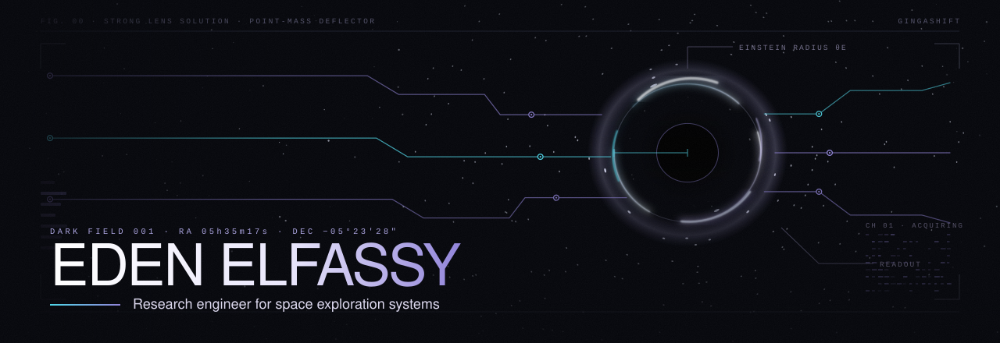

<!-- ============================== LINK ROW ================================
     Three custom buttons, each a small SVG wrapped in a link.
     A fourth, assets/btn-email.svg, is ready: uncomment it and add your address.
-->

  
  
  
  <!--  -->

<!-- ============================== NOW STRIP ==============================
     assets/now-strip.svg · 1012×166 — the three things happening right now.
-->
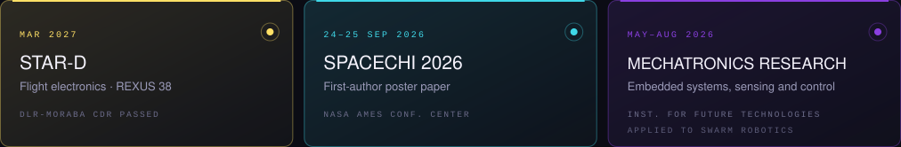

<!-- ============================== INTRODUCTION ============================
     assets/orb.svg · 420×420 holds the right column.
-->
<table>
<tr>
<td width="62%" valign="top">

### Hey -> I'm Eden

I build the electronics, embedded systems and scientific software that let experiments survive the environments we send them into, and the interfaces that let people read what comes back.

Right now that means four flight boards for **STAR-D**, an experiment flying on a sounding rocket in 2027, a poster paper at **SpaceCHI 2026**, and research on how decentralised robot swarms behave when nobody is in charge.

Between the soldering iron and the telescope, the thread is the same: instruments that go somewhere hard, and a way to read what they bring back.

</td>
<td width="38%" align="center" valign="middle"></td>
</tr>
</table>

<!-- ============================== SELECTED RECORD =========================
     The highest-value block on the page: what has actually happened, dated.
     assets/hdr-record.svg · 1012×112
-->
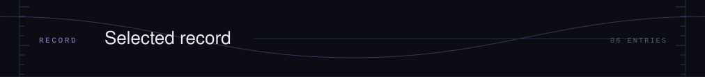

| | | |
|:--|:--|--:|
| **MAR 2027** | **Co-founder &amp; Electronics Lead, STAR-D (REXUS 38)** Electrical architecture and four flight boards for an ESA-supported sounding-rocket experiment. Critical Design Review passed at DLR-MORABA, June 2026. | `ESA REXUS/BEXUS · DLR` |
| **SEP 2026** | **First author, poster paper at SpaceCHI 2026** “Design Considerations for Tangible Human–Swarm Interaction in Orbital Habitat Inspection.” Conference held 24–25 September at the NASA Ames Conference Center. | `NASA AMES CONF. CENTER` |
| **MAY–AUG 2026** | **Research internship in decentralised swarm robotics** Institute for Future Technologies. Collective behaviour on STM32 and ESP32 platforms: leader/follower dynamics, perception, distance keeping, human–swarm interaction. | `INST. FOR FUTURE TECH.` |
| **2026** | **Roll control system, C'Space 2026** Designed the onboard control board for an active roll control subsystem, integrated into the vehicle's mechanical stack. | `CNES · PLANÈTE SCIENCES` |
| **SINCE SEP 2025** | **Systems member, NASA RASC-AL 2026 with the Illinois Space Society** Systems work on the team's concept for mining and advanced transformation of regolith for infrastructure and expansion. | `ILLINOIS SPACE SOCIETY` |
| **JUL 2025** | **C'Space 2025 launch campaign with LéoFly** Student engineer and Communication &amp; Design lead: team identity, website and project outreach. The team launched RedFly, Solaris and Zenith during the campaign, 5–12 July 2025. | `CNES · PLANÈTE SCIENCES` |

<!-- divider 01 · 1012×72 · the arc leaves at the height the next one picks up -->
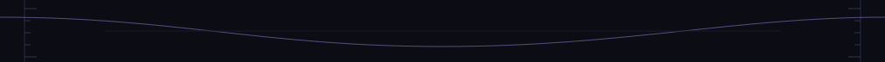

<!-- ============================== STAR-D FEATURE PLATE ====================
     The flagship project, given its own full-width block with three figures.
     assets/hdr-star-d.svg · 1012×112
-->
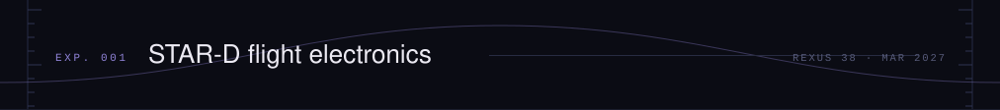

STAR-D studies the effect of microgravity on phagocytosis in *Dictyostelium*, using automated microscopy and microfluidics aboard a sounding rocket.

Co-founder and Electronics Lead since September 2025 in an international team. I designed the electrical architecture and the four flight boards; prototypes are assembled, with debugging and integration under way.

<!-- STAR-D figure plate — three images in one row.
     assets/star-d-module.png · assets/star-d-mainboard.png · assets/star-d-5v-board.png -->
<table>
<tr>
<td width="40%">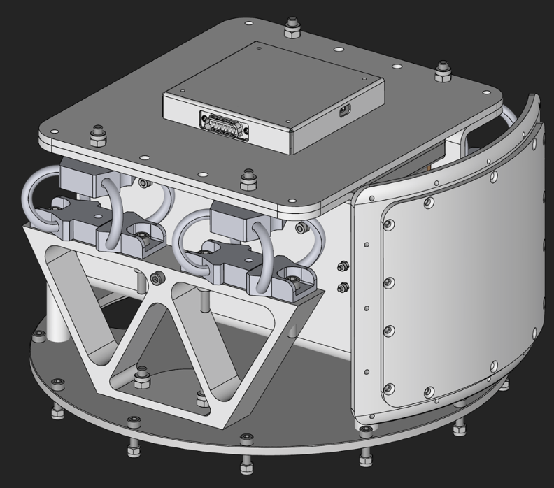</td>
<td width="30%">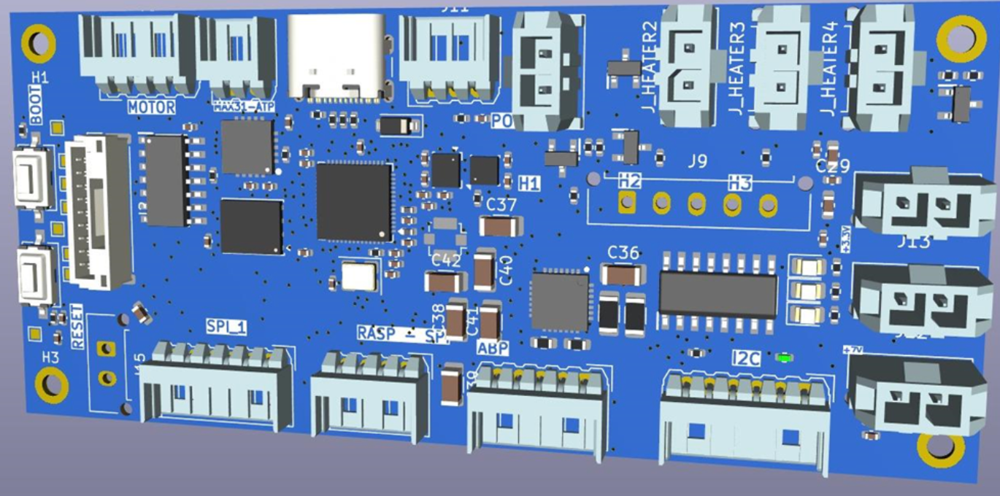</td>
<td width="30%">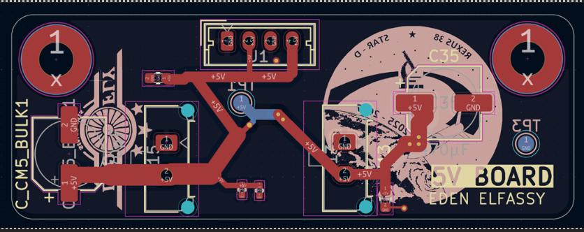</td>
</tr>
<tr>
<td><code>FIG. 01 · EXPERIMENT MODULE ASSEMBLY</code></td>
<td><code>FIG. 02 · MAIN BOARD</code></td>
<td><code>FIG. 03 · 5 V BOARD</code></td>
</tr>
</table>

<!-- The four flight boards -->
| BOARD | FUNCTION |
|:--|:--|
| `MAIN BOARD` | Experiment control, motor driver, heaters, sensor bus |
| `POWER BOARD` | Rocket bus conditioning and protection |
| `5 V BOARD` | Regulated rail to the compute module and microscope LEDs |
| `LED BOARD` | Illumination for the imaging chain |

`CDR · DLR-MORABA · JUN 2026`  `FLIGHT · MAR 2027`

<!-- ============================== RESEARCH & MISSIONS =====================
     assets/hdr-missions.svg · 1012×112
-->
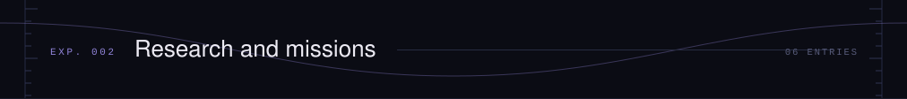

<!-- M-01 · C'Space 2025 with LéoFly -->
<table>
<tr>
<td width="55%">

`M-01`  `5–12 JUL 2025`

### C'Space 2025 with LéoFly

Student engineer and Communication &amp; Design lead: visual identity, website and outreach for the team. LéoFly launched RedFly, Solaris and Zenith during the campaign at the CNES / Planète Sciences site.

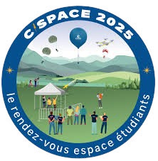

`CNES · PLANÈTE SCIENCES`

</td>
<td width="22%" align="center">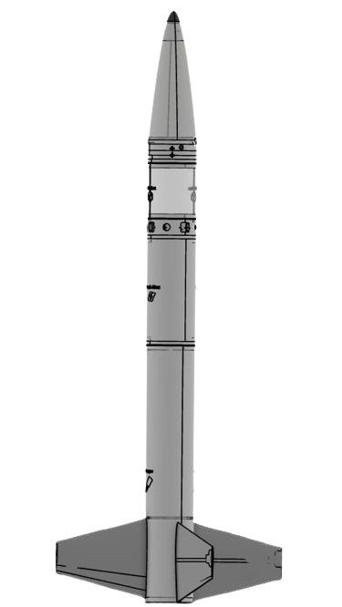 <code>REDFLY</code></td>
<td width="23%" align="center">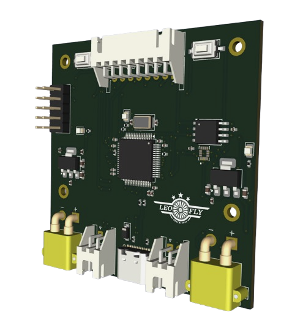 <code>AVIONICS</code></td>
</tr>
</table>

<!-- M-02 · C'Space 2026 roll control — her own subsystem -->
<table>
<tr>
<td width="58%">

`M-02`  `C'SPACE 2026`

### Roll control system

Onboard electronics for an active roll control subsystem: sensing, actuation drive and control interface, designed as a compact board integrated into the mechanical stack.

`MY OWN SUBSYSTEM · BOARD DESIGN`

</td>
<td width="42%" align="center">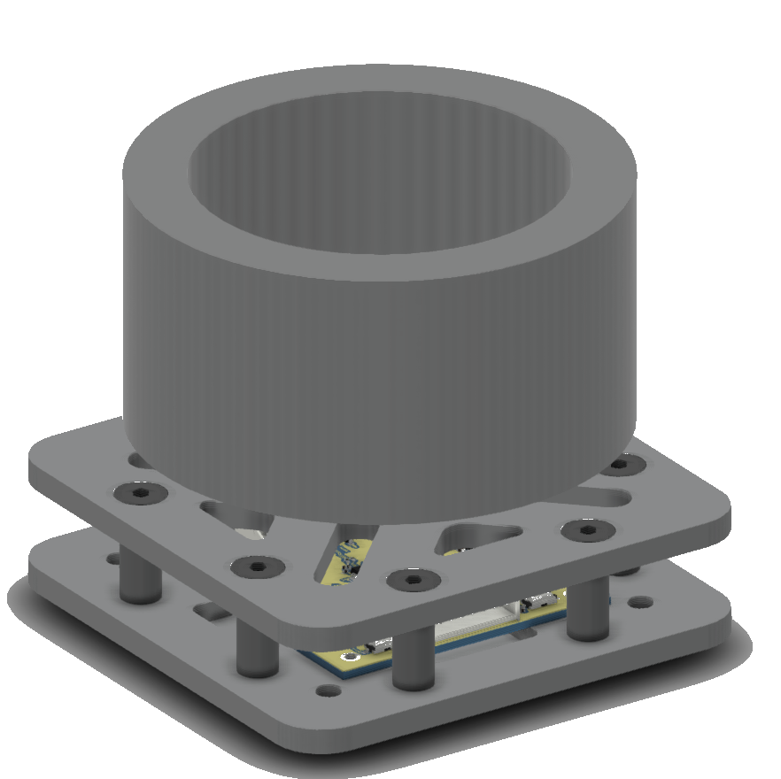 <code>ROLL CONTROL ASSEMBLY</code></td>
</tr>
</table>

<!-- M-03 and M-04 side by side -->
<table>
<tr>
<td width="50%" valign="top">

`M-03`  `24–25 SEP 2026`

### SpaceCHI 2026

First author of “Design Considerations for Tangible Human–Swarm Interaction in Orbital Habitat Inspection.” Accepted poster paper.

`HELD AT NASA AMES CONFERENCE CENTER`

</td>
<td width="50%" valign="top">

`M-04`  `RESEARCH`

### Decentralised swarm behaviour

Research internship on collective behaviour in decentralised robot swarms. STM32 and ESP32 platforms, leader/follower dynamics, perception and distance keeping, PCB fabrication and debugging, human–swarm interaction.

`INSTITUTE FOR FUTURE TECHNOLOGIES`

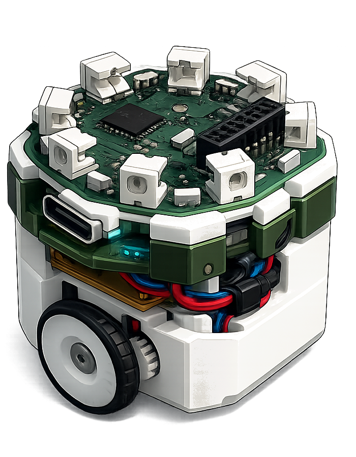

</td>
</tr>
</table>

<!-- M-05 · AstroPhenomena Explorer -->
`M-05`  `IN DEVELOPMENT`

### AstroPhenomena Explorer

An interactive scientific platform for astronomical phenomena: simulation, observability windows and visualisation of astrophysical data, built to make an observing decision readable at a glance.

`PYTHON · ASTROPY · NEXT.JS · THREE.JS`

<!-- M-06 · NASA RASC-AL -->
<table>
<tr>
<td width="60%" valign="middle">

`M-06`  `SINCE SEP 2025`

### NASA RASC-AL 2026 with the Illinois Space Society

Systems member of the team competing in the Revolutionary Aerospace Systems Concepts / Academic Linkage forum, on mining and advanced transformation of regolith for infrastructure and expansion.

</td>
<td width="40%" align="center" valign="middle">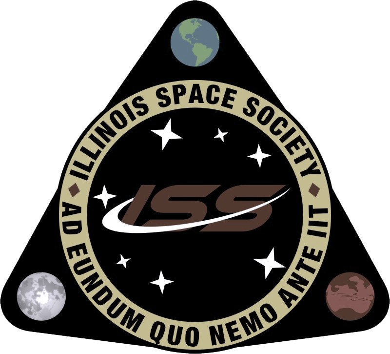</td>
</tr>
</table>

`FIG. 04 · MATRIX · 2026 RASC-AL COMPETITION POSTER · UNIVERSITY OF ILLINOIS URBANA-CHAMPAIGN`

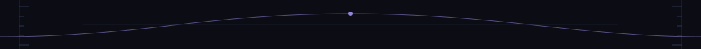

<!-- ============================== FEATURED SYSTEMS ========================
     assets/hdr-systems.svg · 1012×112
     Repository links — edit the URLs if a repo is renamed.
-->
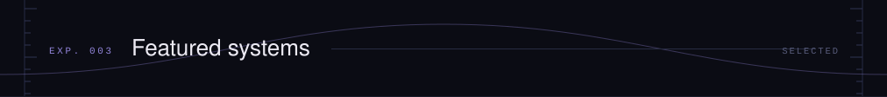

| | | |
|:--|:--|--:|
| `S-01` | **[star-d-electronics](https://github.com/GingaShift/star-d-electronics)** Flight electronics for the STAR-D experiment: board architecture, sensor instrumentation and experiment control firmware. | `C · STM32 · KICAD` |
| `S-02` | **[nova-retrieval-engine](https://github.com/GingaShift/nova-retrieval-engine)** NOVA, a retrieval engine for scientific corpora: indexing, ranking and query evaluation over structured document sets. | `PYTHON · IR` |
| `S-03` | **[cdataframe-engine](https://github.com/GingaShift/cdataframe-engine)** A dataframe implementation written from scratch in C: memory layout, typed columns and manual allocation strategy. | `C · DATA STRUCTURES` |
| `S-04` | **[Anssi-Vulnerability-Intelligence](https://github.com/GingaShift/Anssi-Vulnerability-Intelligence)** Collection and analysis of published vulnerability advisories: parsing, enrichment and severity intelligence. | `PYTHON · SECURITY` |

<!-- ============================== RESEARCH COORDINATES ====================
     assets/hdr-coordinates.svg · 1012×112
     assets/coordinates.svg     · 1012×420 — the orbital field chart.
     The seven domain labels live as <text> nodes inside coordinates.svg.
-->

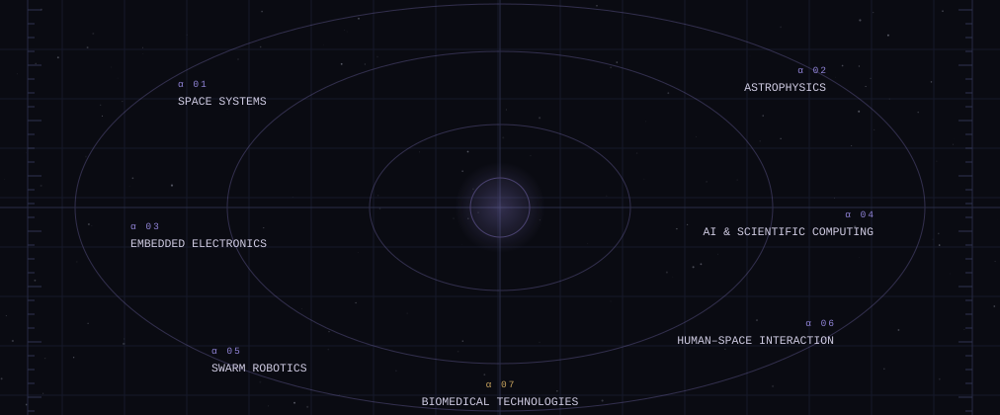

<!-- ============================== INSTRUMENTATION =========================
     assets/hdr-instrumentation.svg · 1012×112
     Tools grouped by function rather than listed as badges.
-->
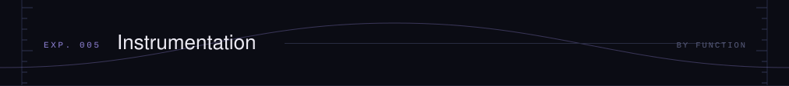

| | |
|:--|:--|
| `SCIENTIFIC COMPUTING` | Python · NumPy · SciPy · Astropy · Pandas · Matplotlib |
| `EMBEDDED SYSTEMS` | C · STM32 · ESP32 · FreeRTOS · UART / I²C / SPI · sensor drivers |
| `ELECTRONICS &amp; PCB` | KiCad · schematic capture · multilayer routing · bring-up · debugging |
| `AI &amp; DATA` | PyTorch · scikit-learn · CNNs · gradient boosting · evaluation design |
| `INTERACTIVE VISUALISATION` | React · Next.js · Three.js · D3 · WebGL |
| `PROTOTYPING &amp; RESEARCH` | Experimental design · test benches · Git · LaTeX · technical writing |

<!-- ============================== TRAINING ================================
     assets/hdr-training.svg · 1012×112
-->
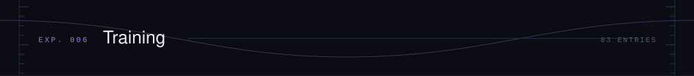

| | | |
|:--|:--|:--|
| `2024 · 2028` | `SINCE 2024` | `SUMMER 2025` |
| **ESILV, engineering degree** Generalist engineering. Creative Technology major and MSc with the Institute for Future Technologies from September 2026. | **Observatoire de Paris, PSL** University diploma in astronomy and astrophysics. First year completed; admitted to the second. | **Queen's University Belfast** Emerging Technologies for Sustainability &amp; Health. Team certificate for excellent oral presentation. |

<!-- ============================== FOOTER SIGNATURE ========================
     assets/footer.svg · 1280×360 — closing orbit, signature line, coordinates.
-->
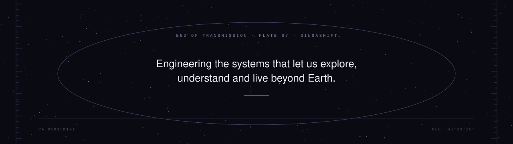

  <a href="https://www.linkedin.com/in/elfassy-eden"><code>LINKEDIN</code></a>
  &nbsp;·&nbsp;
  <a href="https://github.com/GingaShift"><code>GITHUB</code></a>

